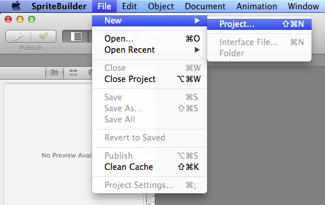

We'll be using SpriteBuilder to make this game. When we are done, the game will look like this:

<!-- > [info]
> If you are unfamiliar with or don't have SpriteBuilder and Xcode yet, please [read this](https://www.makeschool.com/tutorials/getting-started-with-spritebuilder-and-swift/installing-spritebuilder) first. You should install both SpriteBuilder and Xcode. -->

## Creating a new project

> [action]
> Open SpriteBuilder.
>
> Let's get to work by creating a new SpriteBuilder project:
>
> 
>
> Name your new project `GameOfLife`. Make sure you select `Swift` as your *primary language*:
>
> 

Once the project is created, open Finder and take a look at the folder structure of your project. If you can't find your project in Finder, search for it using Spotlight at the top right of your screen.

> [info]
> To open the folder, right click and select `Show Package Contents`:
>
> 

The folder structure should look something like this:

SpriteBuilder created a new folder (`GameOfLife.spritebuilder`). Inside it are a SpriteBuilder project (`GameOfLife.ccbproj`) and a new Xcode project (`GameOfLife.xcodeproj`).

The default SpriteBuilder project comes with one scene called `MainScene.ccb`. Your empty project should look like this:

## Testing your setup

Let’s make sure everything was generated correctly.

> [action]
> Click the publish button (on left side of the toolbar) in SpriteBuilder:
>
> 
>
> Now open GameOfLife.xcodeproj to view the project in Xcode. Run this on the iPhone simulator and verify it shows the “SpriteBuilder” message:
>
> 

Congratulations! Now you have run your first SpriteBuilder project and you know your tools are working.
