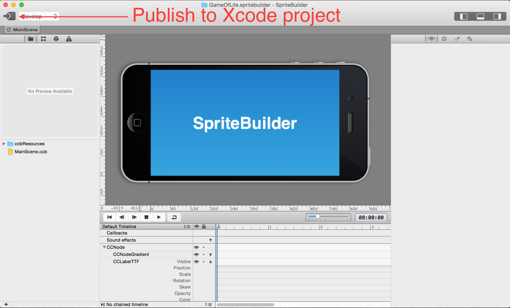

Let's get to work by creating a new SpriteBuilder project:

Name your new project “GameOfLife”. Make sure you select Swift as your primary language:

Once the project is created, open
Finder and take a look at the folder structure of your project. If you
can't find your project in Finder, search for it using Spotlight at the
top right of your screen.
To open the folder, right click and Show Package Contents:

The folder structure should look something
like this:

SpriteBuilder created a new folder (GameOfLife.spritebuilder). Inside it
are a SpriteBuilder project (GameOfLife.ccbproj) and a new Xcode project
(GameOfLife.xcodeproj).

The default SpriteBuilder project comes with one scene (MainScene). Your
empty project should look like this:

Testing your setup
==================

Let’s make sure everything was generated correctly. Click the publish
button (on left side of the toolbar) in SpriteBuilder:

Now open GameOfLife.xcodeproj to view the project in Xcode. Run this on
the iPhone simulator and verify it shows the “SpriteBuilder” message:

Congratulations! Now you have run your first SpriteBuilder project and
you know your tools are working.
