We are going to use SpriteBuilder for this game and in the first step we
will set up the user interface. Once we are done with this chapter the
UI of the game will look like this:

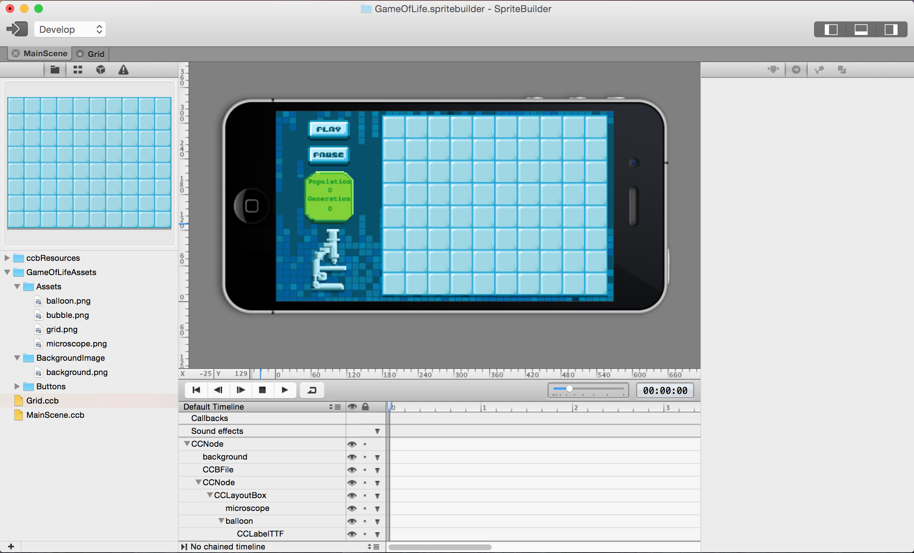

Getting started
===============

Get started by downloading our [art
pack](https://s3.amazonaws.com/mgwu-misc/GameOfLife+SpriteBuilder+Tutorial/GameOfLifeAssets.zip)
for this game.

After you unpacked it, drag the *GameOfLifeAssets* folder into your
SpriteBuilder project onto the left panel. This will automatically add
the resources to your project.

We won't create a tablet version of this game and the assets are
provided in iPhone retina resolution (2x). We need to change a project
setting to tell SpriteBuilder that the assets we are using are provided
in 2x resolution:

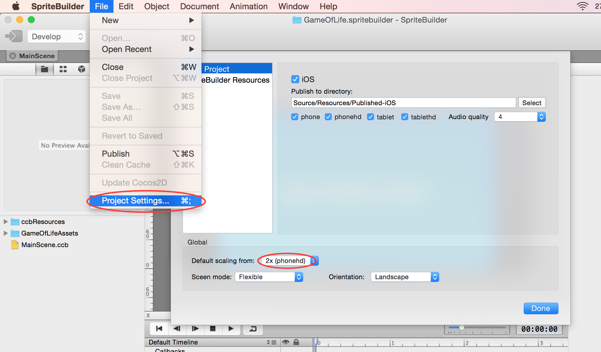

Now open *MainScene.ccb* and highlight CCNodeGradient in the timeline.
Hit the delete key. Do the same for CCLabelTTF - you should end up with
a black screen. Note that you cannot delete the root CCNode.

Add a background image
======================

Drag *background.png* to the stage of *MainScene.ccb*. We want to center
the background so set the anchor point to (0.5, 0.5) and choose the
position to be expressed *in % of parent container* - and choose 50% for
both X and Y position:

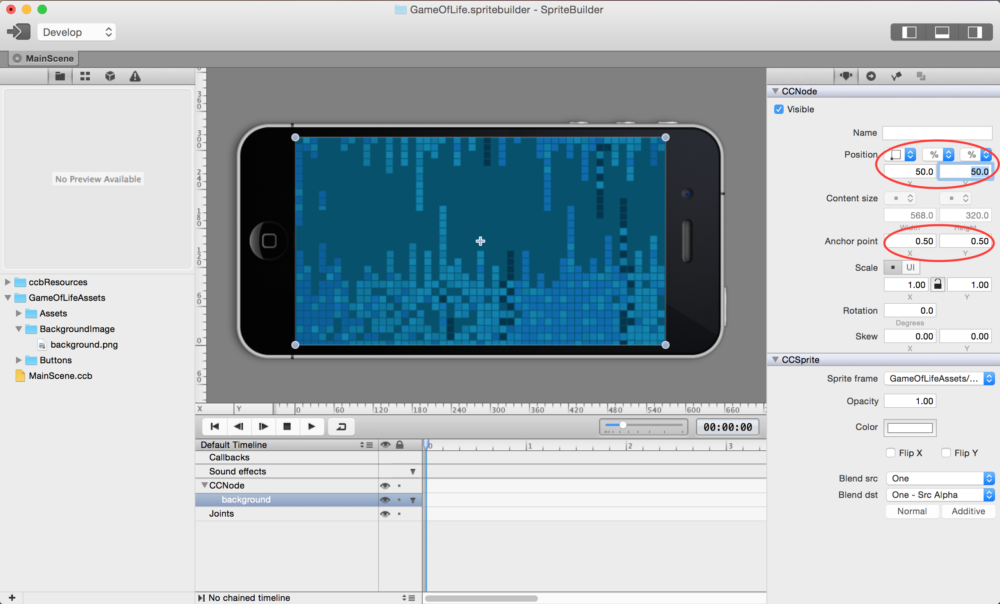

You can test that the background is centered correctly by changing the
resolution of the stage. That feature gives you a preview of how your
game will look on different device types. Choose *Document-\>Resolution*
to switch between *Phone Landscape* and *Phone Landscape (short)*:

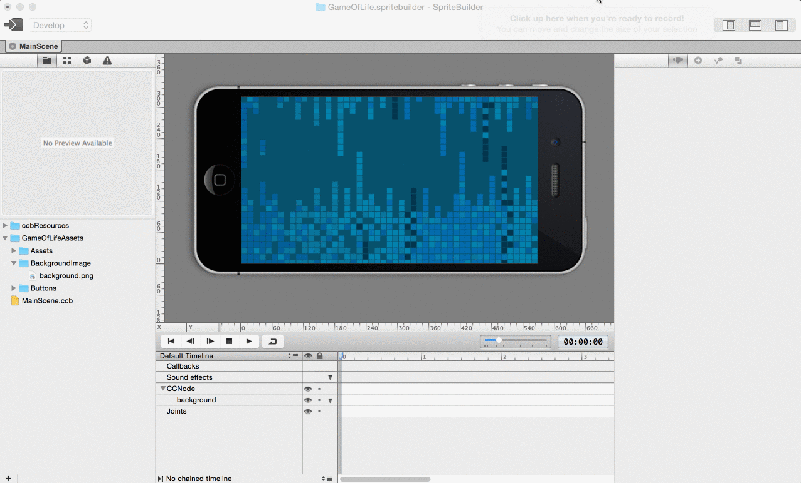

Your background image should stay centered in both resolution modes.

Creating a grid
===============

We will create the grid in a separate CCB-File because it will be linked
to a custom class later on. Create a new CCB-File (File\>New\>File) of
type Sprite and call it *Grid.ccb*:

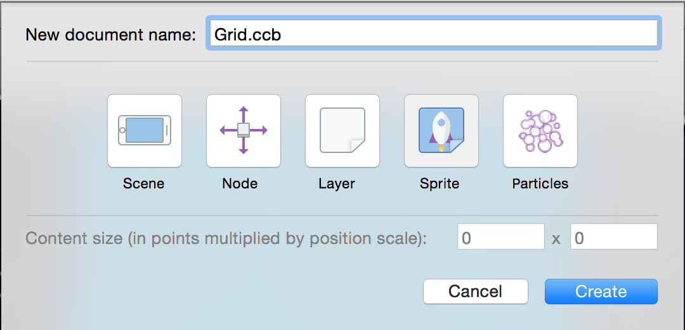

Select the *CCSprite* root node of *Grid.ccb* in the timeline and set
the *Sprite Frame* to *grid.png* in the right panel. Also set the anchor
point to (1, 0.5):

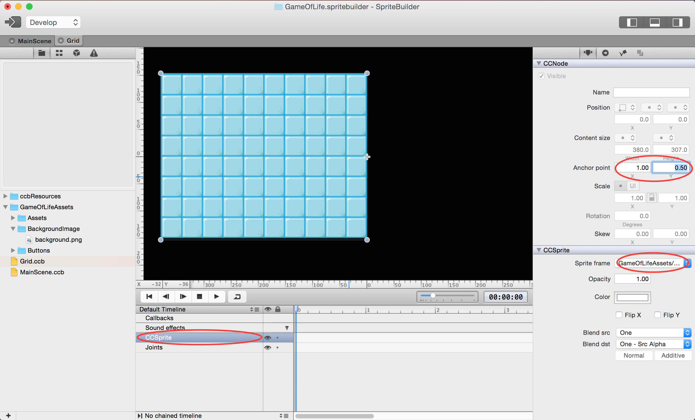

We set the anchor point to (1, 0.5) because we want to position the grid
from the right edge of the screen.

**Make sure to save (cmd+s) or your grid will not display correctly
later on!**

Add the grid to the MainScene
=============================

Now open *MainScene.ccb* again by double clicking on it and drag
*Grid.ccb* onto the stage. This will add the grid as Sub-CCB-File to the
MainScene. Now change the positioning of the grid:

-   choose the top right corner as reference corner (the first of the
    three dropdown boxes)
-   set the y position to be expressed in *% of parent container*
-   choose a position of (10,50)

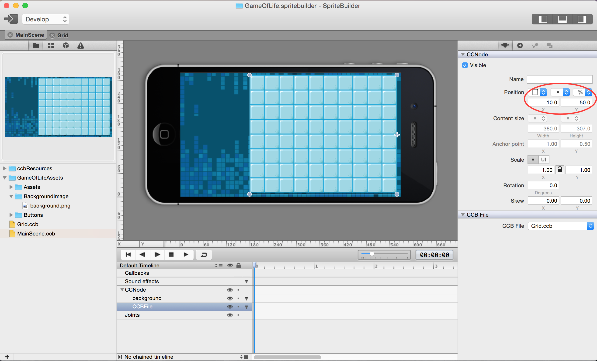

This means the grid will be positioned 10 points from the right edge and
it will be vertically centered. You can again test by switching between
the different resolutions.

Add a container node for the left panel
=======================================

As you can see on the screenshot at the beginning of this tutorial we
will have a couple of UI elements on the left side of the screen. We
want all of them to be centered. To achieve this we are going to use a
little layout trick where we use an invisible *CCNode* and position other nodes inside of it.

Add a *CCNode* to your scene by choosing a Node from the Node Library View. Set the width to be defined in *Width
insets in point*. This means the Node will have the size of the parent
node **minus** the value you defined as width. This is ideal for our
User Interface because we can setup the left node to take up all space
not used by the grid. Set the height to be 100% of the parent container:

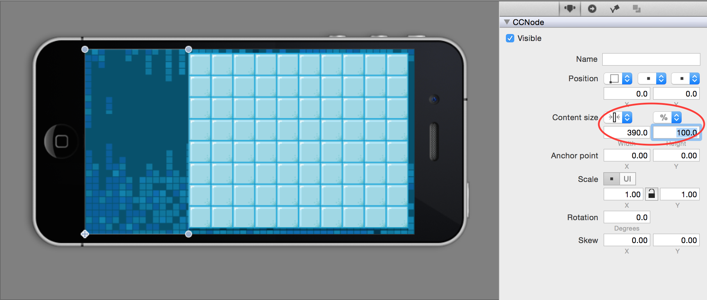

Before you move on, double check that your size settings are exactly the
same as shown in the screenshot. When you test with different
resolutions you should see how the left node resizes, always taking all
the space that is not used by the grid.

Layout Box & Buttons
====================

We have a couple different elements that we need to add to the left
panel and they all need to be placed one below the other. Instead of
doing this manually we can use a nice Cocos2d component called
*CCLayoutBox*.

Drag a *Box Layout* from the Node library to your scene - make sure you add it as
a child of the left container node we just created. Set the anchor point
to (0.5, 0.5) and x and y to 50% of the parent container - this will
center the *Box Layout* in the left Node. Also set the *layout
direction* to *vertical* so that the Nodes are arranged one below the
other:

Great! Now it is time to set up your game's UI!

Go to the Node Library (left panel, third tab) and find the Button node.
Add 2 buttons to the layout box. Set the anchor point of both butons to
(0.5, 0.5).

Now go to your resources and add *balloon.png* and *microscope.png* to
the layout box. Reorder the elements so that they appear in the same
order as displayed in the image below. To do so you have to reorder the
elements in the timeline.

Finally, increase the *Spacing* on the *CCLayoutBox* to 8 points.

When you are done it should look like this:

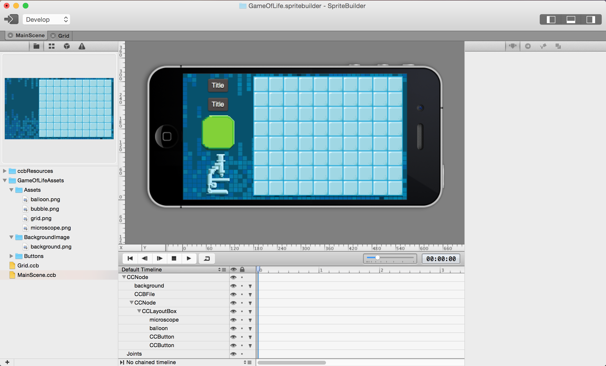

Now set the correct images for the buttons. You need to remove the
title, set the preferred size to the full size of the image (70,35) and
set the sprite frames for the *Normal State* (play.png and pause.png)
and the *Highlighted State* (play-pressed.png and pause-pressed.png):

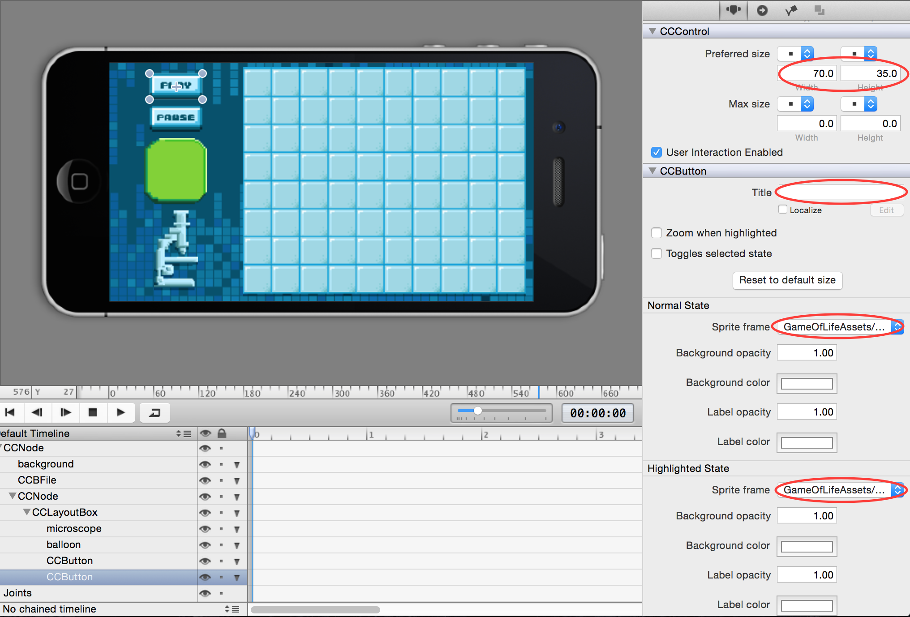

In the next step add four labels as children of the balloon, these will
form our scoreboard. To do so, go back to the Node Library, find the
Node type called *Label TTF*, and drag four of them onto the balloon in
your timeline. Adjust the labels to match the screenshot (hint - this is a great chance to practice using *Box Layout* again!) :

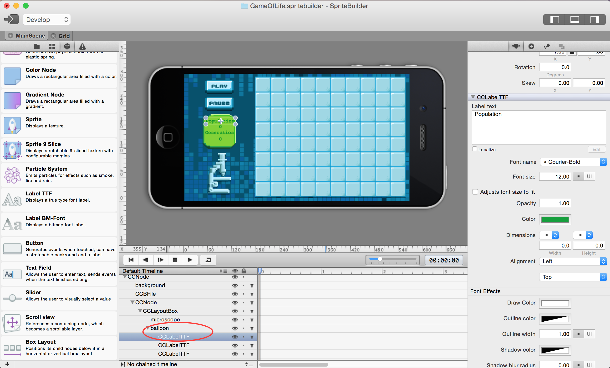

Great! Now the UI is set and autoresizes nicely for 3.5-inch and 4-inch
phones. Now it's time to set up code connections before we switch to
Xcode and you start implementing the actual game. We want to tell
SpriteBuilder how this UI you've created will interact with the classes
and methods we will implement in code.

Set up code connections
=======================

Let's start with the labels - we need code connections in order to
update the label values as the game state changes. Select the second label,
go to the Code Connections view (second button on the top of the right
panel), and create a code connection called *populationLabel* - be
sure to choose *Doc root var* from the dropdown box and leave the
*Custom Class* field blank!

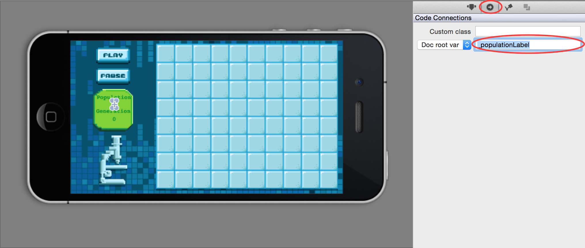

Now do the same thing for the bottom label, but call the connection
*generationLabel*.

We also want to create a connection for our grid. Select the grid on the
stage and create a connection called *grid* in the same way you
created connections for the labels.

Next we have to tell SpriteBuilder which methods to call when our
buttons are touched.

Set the selector *play* for the play button. Make sure to select the
*Document root* as target:

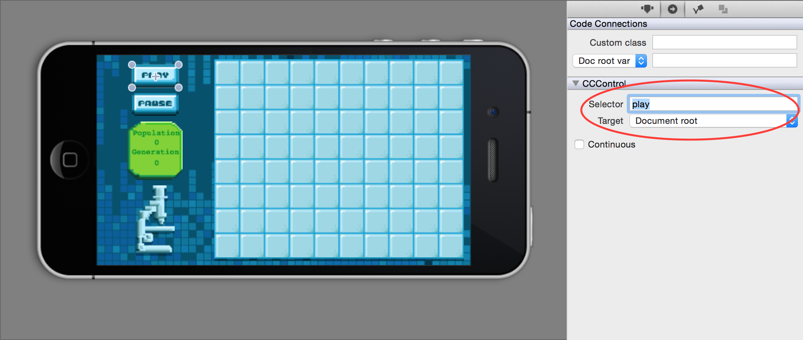

**Repeat this step and set the selector *pause* for the pause button.**

Now for the very last step in SpriteBuilder! Open *Grid.ccb* in your
resources by double clicking on it and set a custom class *Grid* for the
root node:

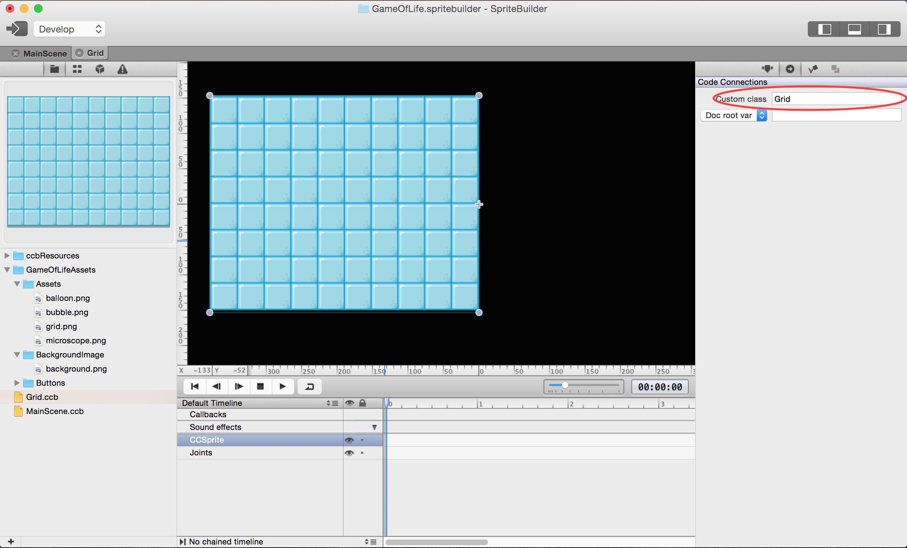

Now save, publish (File > Publish) and open your Xcode project by going to File > Open Project in Xcode.